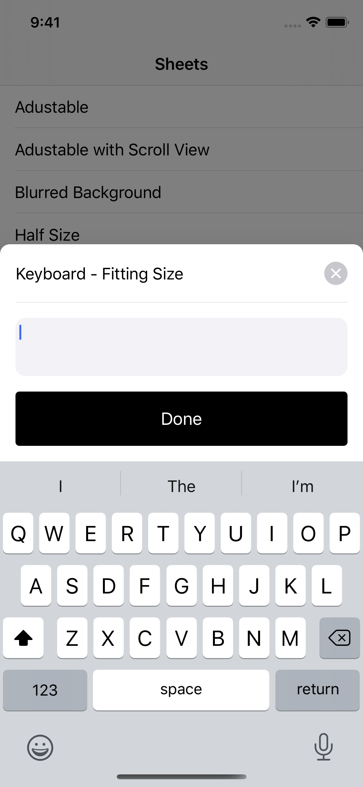

# Duvet

A configurable framework for presenting bottom sheets on iOS.


## Contents

* [Features](#features)
* [Requirements](#requirements)
* [Installation](#installation)
    * [Swift Package Manager](#swift-package-manager)
    * [CocoaPods](#cocoapods)
    * [Carthage](#carthage)
* [Usage](#usage)
    * [Overview](#overview)
    * [Configuration](#configuration)
    * [Scroll View Interaction](#scroll-view-interaction)
    * [Pushing/Popping Sheets](#pushingpopping-sheets)
* [Examples](#examples)
* [License](#license)

## Features

* Sheets can be presented in different sizes:
    * Full screen sheets are similar  to `UIModalPresentationPageSheet` on iOS 13+.
    * Half screen sheets.
    * Fitting size sheets are sized to the content displayed, when smaller than a full screen sheet.
* Content in the sheet can be embedded in a scroll view to support scrolling when the content height exceeds that of the sheet.
* Supports sliding the sheet between different positions and swiping to dismiss.
* Sheets can be stacked - push additional sheets on and then pop them off.
* Automatically adjusts the sheet when the keyboard appears/disappears.
* Configure display properties like the top inset of a full-screen sheet, optional handle to indicate sheet sliding, dimmed background view and more.

| Full Sheet | Half Sheet | Fitting Size Sheet | Fitting Size with a Keyboard |
| --- | --- | --- | --- |
|  |  |  |  | 

## Requirements

* iOS 11+

## Installation

### Swift Package Manager

Add `.package(url: "https://github.com/livefront/Duvet.git", from: "0.0.1")` to your `Package.swift` file dependencies.

### CocoaPods

Add `pod Duvet` to your `Podfile`.

### Carthage

Add `github livefront/Duvet` to your `Cartfile`.

## Usage

### Overview

1. Import `Duvet` into the file that you will present a sheet from.

    ```swift
    import Duvet 
    ```

1. Create a `SheetItem` with the view controller that should will be shown in the sheet.

    ```swift
    let sheetItem = SheetItem(
        viewController: viewController,
        configuration: SheetConfiguration(),
        // See Scroll View Interaction below for an example with a scroll view.
        scrollView: nil
    )
    ```

1. Create a `SheetViewController`. The `SheetViewController` is a container view controller for a stack of sheets, similar to `UINavigationController`. It will allow you to push on and pop off additional `SheetItem`s.

    ```swift
    let sheetViewController = SheetViewController(sheetItem: sheetItem)
    sheetViewController.modalPresentationStyle = .custom

    // Note: `sheetTransitioningDelegate` needs to be retained by the presenting
    // view controller since `sheetViewController` only keeps a weak reference.
    let sheetTransitioningDelegate = SheetTransitioningDelegate()
    sheetViewController.transitioningDelegate = sheetTransitioningDelegate
    ```

1. Conform the presenting view controller to `SheetViewControllerDelegate` to handle dismissing the sheet.

    ```swift
    extension PresentingViewController: SheetViewControllerDelegate {
        func dismissSheetViewController() {
            dismiss(animated: true, completion: nil)
        }
    }
    ```

1. Then the `SheetViewController` can be presented by your presenting view controller.

    ```swift
    <presentingViewController>.present(sheetViewController, animated: true)
    ```

### Configuration

Various parameters can be configured for a sheet via a `SheetConfiguration` when creating a `SheetItem.`

| Property | Description |
| --- | --- |
| `cornerRadius` | The corner radius of the sheet. Defaults to 10. |
| `dismissKeyboardOnScroll` | True if the keyboard should be dismissed when the sheet view's scroll view is scrolled. Defaults to `true`. |
| `handleConfiguration` | An optional configuration for displaying a handle in or above the sheet to indicate that the sheet can be panned. Defaults to `nil` for no handle. |
| `initialPosition` | The initial position of the sheet when presented. Defaults to `.open` for a full sized sheet. |
| `supportedPositions` | The list of positions that the sheet can be adjusted to via sliding. Defaults to `[.open]`, which only allows the sheet to be fully sized or closed. |
| `topInset` | The number of points between the top of the sheet and the top safe area. Defaults to 44. |

### Scroll View Interaction

If the view controller that you want to show in the sheet has a scroll view that wraps the sheet content, `Duvet` needs to be able to interact with it so that it knows whether you should be scrolling the scroll view or sliding the sheet.

For this interaction to occur, pass a reference to your view controller's scroll view when creating the `SheetItem`:

```swift
let sheetItem = SheetItem(
    viewController: viewController,
    configuration: SheetConfiguration(),
    scrollView: viewController.scrollView 
)
```

`Duvet` will make the following changes to the scroll view:

* `Duvet` will become the `UIScrollView` delegate. If there was an existing `delegate` on the scroll view, `Duvet` will continue forwarding any `UIScrollViewDelegate` methods to the original `delegate`. It's important to set a `delegate`, if necessary, *before* creating the `SheetItem` to continue receiving `UIScrollViewDelegate` methods.
* Enables `alwaysBounceVertical`. This is required for sliding the sheet or swipe to dismiss.
* The sheet view will also add itself as a target of the scroll view's `panGestureRecognizer`.

### Pushing/Popping Sheets

`SheetViewController` supports managing a stack of `SheetItem`s. This allows additional sheets to be pushed on and then popped off of the stack.

1. Display an initial sheet.

    ```swift
    let sheetItem = SheetItem(
        viewController: <view controller for the first sheet> 
        configuration: SheetConfiguration(),
        scrollView: nil
    )
    let sheetViewController = SheetViewController(sheetItem: sheetItem)
    sheetViewController.delegate = self
    sheetViewController.modalPresentationStyle = .custom
    sheetViewController.transitioningDelegate = sheetTransitioningDelegate
    present(sheetViewController, animated: true)
    ```

1. Push an additional sheet onto the sheet stack.

    ```swift
    let sheetItem2 = SheetItem(
        viewController: <view controller for the second sheet> 
        configuration: SheetConfiguration(),
        scrollView: nil
    )
    sheetViewController.push(sheetItem: sheetItem2, animated: true)
    ```

1. Pop that sheet off of the sheet stack.

    ```swift
    sheetViewController.pop(animated: true)
    ```

## Examples

There is an example application showing how to present and configure `Duvet` for many common use cases in the `Example` directory.


## License

This library is released under the Apache 2.0 license. See the LICENSE file for details.


